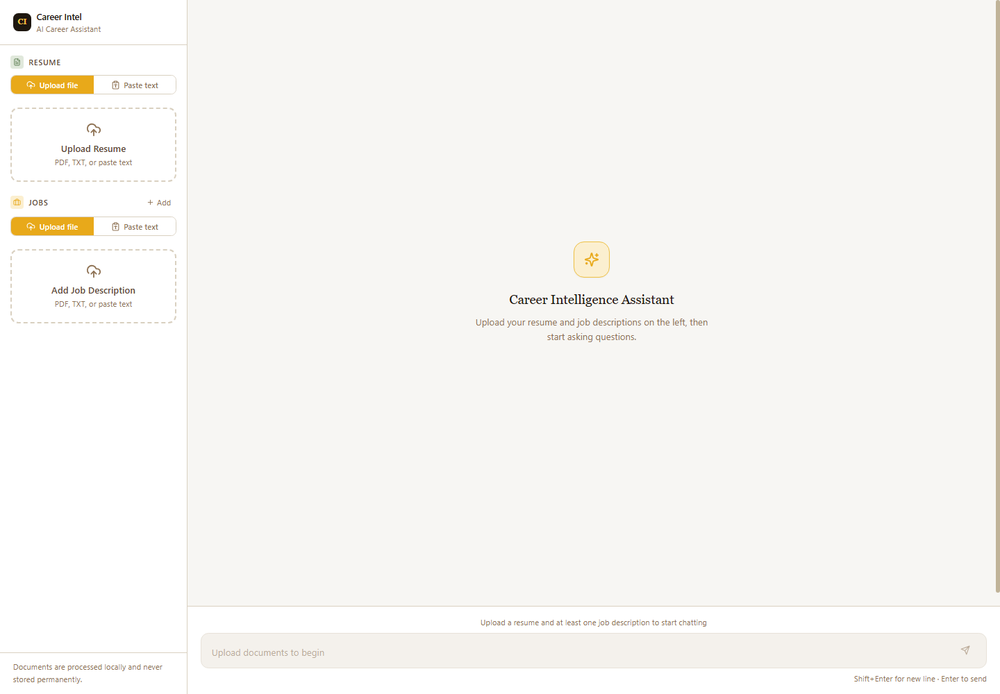
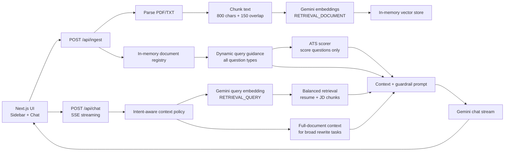
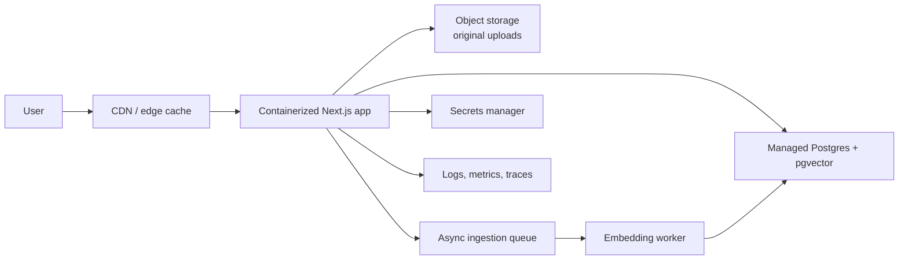

# Career Intel - AI Career Assistant

A full-stack conversational assistant for comparing a resume against one or more job descriptions. Users can upload or paste a resume and job postings, then ask about fit, skill gaps, keyword coverage, estimated ATS-style score, experience alignment, and interview preparation.

The current MVP is intentionally simple: Next.js full stack app, Gemini for embeddings and answer generation, an in-memory vector store, and a deterministic ATS-style scoring helper for score/keyword-match questions.



Additional screenshots can be added under [`screenshots/`](./screenshots/) before final submission.

---

## Quick Setup

**Prerequisites:** Node.js 18+ and npm.

```bash
npm install
cp .env.example .env.local
# Add your GEMINI_API_KEY to .env.local
npm run dev
# http://localhost:3000
```

**Environment variables:**

| Variable | Required | Default | Description |
|---|---:|---|---|
| `GEMINI_API_KEY` | Yes | - | Google Gemini API key |
| `GEMINI_CHAT_MODEL` | No | `gemini-2.5-flash-lite` | Streaming answer generation model |
| `GEMINI_EMBEDDING_MODEL` | No | `gemini-embedding-001` | Embedding model for documents and questions |
| `LLM_MAX_TOKENS` | No | `2048` | Max response tokens |
| `RETRIEVAL_TOP_K` | No | `8` | Number of chunks to retrieve per query, per doc type |
| `RETRIEVAL_MIN_SCORE` | No | `0.25` | Minimum cosine similarity threshold |

---

## Architecture Overview



### Runtime Flow

1. User uploads or pastes a resume/JD.
2. `parser.ts` extracts text from PDF or plain text and derives job metadata such as role title/company when possible.
3. `chunker.ts` splits text into overlapping chunks.
4. `embedder.ts` embeds chunks with Gemini and stores vectors in memory.
5. `chat/route.ts` chooses a context policy for the user question. Normal analytical questions use balanced RAG retrieval, while broad rewrite requests such as "rewrite my whole resume" use full-document context so every resume role and the full JD are available.
6. The route adds dynamic guidance based on the detected intent and streams the Gemini answer back to the UI.

---

## RAG / LLM Approach And Decisions

### LLM Choice

**Final choice:** Gemini via `@google/genai`, defaulting to `gemini-2.5-flash-lite`.

I chose Gemini for the MVP because it keeps the provider surface simple: the same API family handles both embeddings and streamed generation, and it is fast enough for a local prototype. The chat model is configurable through `GEMINI_CHAT_MODEL`, so the app can move to a stronger Gemini model later without changing application code.

**Choices considered:**

- **OpenAI GPT-4o-mini / GPT-4.1-mini:** strong default for structured responses, but would add a second provider if embeddings stayed on Gemini.
- **Claude:** good writing quality, but no native embedding path in this app.
- **Local models:** attractive for privacy, but not worth the setup cost for a working assignment prototype.

**Current generation settings:**

- Temperature: `0.3` for more consistent, grounded responses.
- Max output tokens: `2048`, enough for breakdowns without overly long answers.
- Streaming: SSE from the API route so the UI can show tokens as they arrive.

### Embedding Model

**Final choice:** `gemini-embedding-001`.

The embedder uses Gemini task types deliberately:

- `RETRIEVAL_DOCUMENT` for uploaded resume/JD chunks.
- `RETRIEVAL_QUERY` for user questions.

Embeddings are created in small batches with retry handling. I originally had higher parallelism, but for a local MVP and free-tier usage it is better to be boring and reliable than fast and rate-limited.

**Choices considered:**

- `text-embedding-3-small`: inexpensive and strong, but would mean mixing OpenAI embeddings with Gemini generation.
- Local embedding models: good privacy story, but less assignment-friendly setup.
- Provider-specific managed retrieval: faster to build in some platforms, but less transparent for explaining chunking/retrieval trade-offs.

### Vector Database

**Final choice:** in-memory vector store in `vectorStore.ts`.

The vector store is a `Map` of chunk IDs to chunk text, metadata, and embedding. Querying is brute-force cosine similarity. This is enough for an MVP where the dataset is one resume and a few job descriptions.

**Why this is acceptable for the prototype:**

- No local database setup.
- No Docker requirement.
- Fast enough for tens or hundreds of chunks.
- Easy to understand in review.
- The interface is small: `upsert`, `query`, `deleteByDocumentId`, `clear`, `stats`.

**Production replacement:** Postgres + pgvector is the selected production path because resume/job metadata, chat history, retrieval traces, and vector search can live in the same operational database. See [docs/production_pgvector.md](./docs/production_pgvector.md) and [db/pgvector_schema.sql](./db/pgvector_schema.sql).

### Orchestration Framework

**Final choice:** no LangChain/LlamaIndex for the MVP.

The orchestration is plain TypeScript modules:

- `parser.ts` for text extraction
- `chunker.ts` for chunking
- `embedder.ts` for provider embedding calls
- `vectorStore.ts` for retrieval
- `queryContext.ts` for question-intent guidance
- `atsScorer.ts` for deterministic ATS-style scoring
- `prompts.ts` for system/context prompt construction
- `llm.ts` for streaming Gemini generation

I considered LangChain or LlamaIndex, but the flow is simple enough that a framework would hide more than it helps. For this assignment, I wanted the reviewer to see each decision directly.

### Chunking Strategy

Documents are chunked at around **800 characters** with **150 characters of overlap**.

The splitter prefers:

1. Paragraph boundaries
2. Sentence boundaries
3. Word boundaries
4. Character split as a fallback

This is intentionally conservative. Resume and JD content is dense; very large chunks dilute retrieval, while tiny chunks lose evidence. The overlap protects against losing a skill or qualification at the edge of a chunk.

### Retrieval Strategy

The chat route uses **balanced retrieval**:

- Split active documents into resume IDs and job IDs.
- Retrieve top K chunks from each group separately.
- Always include the first chunk of each active document as an anchor.
- Deduplicate chunks and sort by score.
- Scope retrieval to the documents currently shown in the UI, so stale in-memory docs do not contaminate answers.

This matters because a naive single-vector query can over-retrieve from the resume for alignment questions and starve the LLM of job-description context.

For broad drafting tasks such as "rewrite my whole resume according to this JD," the app deliberately switches away from top-k chunk retrieval and uses **full-document context**. A whole-resume rewrite needs every employer, role, date range, education item, and major section; otherwise the model may collapse older roles or invent placeholders. This context policy keeps normal RAG efficient while making full-document transformations more faithful.

### Dynamic Query Handling

The input box is not limited to predefined questions. Every user message is routed through `queryContext.ts`, which detects broad career-intelligence intents and adds task-specific guidance before the LLM answers.

Current dynamic intents:

- ATS / match score
- Skill gap analysis
- Experience alignment
- Interview preparation
- Resume rewrite/tailoring
- Job comparison
- General career-intelligence questions

The intent layer is intentionally light: it does not replace retrieval or hard-code final answers. It tells the model what shape of answer is useful for the current question while the retrieved resume/JD chunks remain the evidence source.

### Job Metadata Extraction

Job descriptions often start with noisy content such as location, contract type, company boilerplate, or section headers. The ingestion parser uses lightweight heuristics to derive useful job metadata for the sidebar and citations:

- explicit labels such as `Job Title:`, `Role:`, `Position:`, or `Designation:`
- common title/company patterns such as `Software Engineer at Acme` or `Acme - Senior Backend Engineer`
- all-caps role headers such as `FORWARD DEPLOYED ENGINEER`
- company hints such as `Company: ...` or `About Newpage Solutions`

The parser deliberately ignores generic lines like `About the team`, `Location`, `What You'll Do`, and `What You Bring` so uploaded jobs get meaningful titles instead of random header text.

### ATS-Style Scoring As One Branch

Score and keyword-match questions get an extra deterministic context block from `atsScorer.ts`.

The scorer:

- Detects score-style questions such as "ATS score", "keyword match", "fit score", or "resume score".
- Extracts weighted keywords from the JD using known skill terms, requirement lines, phrase extraction, and frequency.
- Compares those keywords against normalized resume text.
- Computes:
  - Overall score
  - Keyword match score
  - Experience alignment score
  - Resume presentation score
  - Matched keywords
  - Missing/weak keywords
  - Resume and JD evidence signals

The LLM then explains this computed analysis. It is still described as a heuristic estimate, not a real proprietary ATS result. Other question types do not use the scorer; they use the general dynamic query guidance plus retrieved RAG context.

### Prompt And Context Management

The prompt has four layers:

1. **System prompt:** role, grounding rules, guardrails, score-request behavior, answer style.
2. **Dynamic query guidance:** intent-specific instructions for the current free-form user question.
3. **Dynamic context:** retrieved chunks for analytical questions, full-document context for broad rewrite tasks, and for score questions only, the computed ATS-style analysis.
4. **Conversation history:** the client sends the last 10 messages to keep context bounded.

Context is injected into the final user turn using `buildUserTurnWithContext`. This keeps the API simple and makes the model answer the current question using the freshest retrieved evidence.

The response prompt is intentionally adaptive rather than one fixed template. Analytical questions get concise evidence-backed comparisons. Rewrite/drafting questions start with the finished content the user can use directly, avoid inline source labels inside resume text, and include only a short rationale afterward.

### Guardrails

The guardrails are pragmatic rather than heavyweight:

- Zod validation on API request bodies.
- Environment validation with fail-fast errors.
- Minimum extracted document length to reject empty/unreadable files.
- Prompt rules requiring evidence-grounded claims.
- Prompt rules distinguishing confirmed vs inferred skills.
- No hiring guarantees.
- No discriminatory advice.
- Rate-limit-aware retry logic for embeddings.
- User-facing error messages for provider/rate-limit failures.
- Dynamic ATS answers must say they are heuristic estimates, not actual ATS decisions.

### Quality Controls

Current automated tests cover:

- Chunking behavior and source labels.
- Parser/job metadata heuristics, including all-caps role titles and labelled job-title lines.
- Prompt construction and guardrail coverage.
- Vector store ranking, filtering, deletion, and stats.
- Dynamic ATS scoring and score-question detection.
- Dynamic query-intent guidance for broad free-form questions.

Current verification commands:

```bash
npm run typecheck
npm test
```

At the time of this README update, the suite passes with **6 test files and 42 tests**.

### Observability

The app uses structured JSON logging through `logger.ts`.

Logged events include:

- Document parsing and PDF page/character counts.
- Chunk counts per document.
- Embedding model, batch size, and batch start offset.
- Vector upsert counts and total chunk count.
- Retrieval candidate counts, returned chunks, top score, and resume/JD split.
- Gemini stream request model, turn count, and max token setting.
- Stream and ingestion errors.

For production, I would send this log stream to CloudWatch, Datadog, Axiom, or OpenTelemetry-backed tracing. I would also add request IDs, user IDs, provider latency, token usage, retrieval score histograms, and answer quality/evaluation labels.

---

## Key Technical Decisions

**Why Next.js API routes instead of a separate backend?**

For this assignment, a separate backend would add deployment and local setup cost without proving much more. Next.js API routes are enough for upload, retrieval, and streamed chat. If the product needed independent backend scaling, I would split it later.

**Why in-memory storage?**

The MVP is a single-user prototype. In-memory storage makes the app easy to run and easy to review. The limitation is explicit: documents disappear on restart and multiple users would share process memory.

**Why SSE streaming?**

SSE is simpler than WebSockets for one-way model streaming. The user sees progress quickly, and the client-side parser is small.

**Why deterministic ATS scoring plus LLM explanation?**

Pure LLM scoring can be inconsistent. A deterministic score block gives repeatable keyword/coverage signals, while the LLM remains useful for explaining gaps and recommending edits.

---

## Engineering Standards Followed

- TypeScript strict mode.
- Runtime validation with Zod.
- No hardcoded secrets.
- Modular RAG pipeline.
- Structured logging.
- User-facing error states.
- Unit tests for core behavior.
- Simple, readable code over framework-heavy orchestration.

**Skipped for time:**

- Auth and multi-user isolation.
- Persistent document storage.
- Production vector DB.
- E2E browser tests.
- Full observability/tracing.
- Offline eval harness.
- Docker/container deployment.

---

## How I Used AI Tools

Claude Code and Codex were used as coding accelerators, not as unattended authors.

My workflow:

- Use AI to scaffold modules, tests, and UI wiring.
- Read and revise generated code before keeping it.
- Run typecheck/tests after changes.
- Prefer small, understandable modules over opaque generated abstractions.
- Ask AI for implementation help, but keep architecture choices tied to the actual assignment constraints.

What I would not do:

- Blindly commit generated README claims.
- Let AI pick providers or architecture without checking the trade-offs.
- Accept a passing UI if the retrieval path or failure modes are unclear.

---

## What I Would Do Differently With More Time

1. Implement the Postgres + pgvector storage adapter described in [docs/production_pgvector.md](./docs/production_pgvector.md).
2. Add hybrid retrieval: keyword/BM25 plus vector search.
3. Extract structured job requirements during ingestion.
4. Add per-document selection and side-by-side job comparison.
5. Add E2E tests for upload -> ingest -> chat -> score and full-resume rewrite flows.
6. Add persistent chat history and cancellation for streaming.
7. Build an evaluation set with known resume/JD pairs and expected answer characteristics.

---

## Productionization Plan

### Selected Production Path: Postgres + pgvector



**Production changes required:**

- Store files in S3, GCS, Azure Blob, or R2 with encryption and lifecycle policies.
- Store users, documents, chunks, vectors, chat sessions, messages, and retrieval events in Postgres.
- Use pgvector HNSW indexes for vector search. The starter SQL schema is in [db/pgvector_schema.sql](./db/pgvector_schema.sql).
- Move embedding to async workers for larger uploads.
- Add authentication and per-user document isolation.
- Add provider rate limits and quotas.
- Add request tracing, provider latency metrics, token usage, and retrieval diagnostics.
- Add an eval harness for answer quality and regression testing.
- Add CI/CD with typecheck, tests, lint, and deployment gates.

**Hyperscaler mapping:** AWS can use App Runner/ECS + RDS/Aurora PostgreSQL + S3 + SQS. GCP can use Cloud Run + Cloud SQL PostgreSQL + Cloud Storage + Pub/Sub. Azure can use Container Apps + Azure Database for PostgreSQL + Blob Storage + Service Bus. Cloudflare can use Workers/Pages for the edge layer with R2 and an external managed Postgres connected through Hyperdrive.

---

## Project Structure

```text
src/
  app/
    api/
      ingest/route.ts   # document upload, parse, chunk, embed, register
      chat/route.ts     # retrieval, ATS scoring context, SSE chat
    globals.css
    layout.tsx
    page.tsx
  components/
    ChatMessage.tsx
    ChatPanel.tsx
    DocumentCard.tsx
    FileUploadZone.tsx
    Sidebar.tsx
  lib/
    env.ts
    logger.ts
    rag/
      atsScorer.ts
      chunker.ts
      embedder.ts
      llm.ts
      parser.ts
      prompts.ts
      queryContext.ts
      registry.ts
      vectorStore.ts
  types/index.ts
tests/
  atsScorer.test.ts
  chunker.test.ts
  parser.test.ts
  prompts.test.ts
  queryContext.test.ts
  vectorStore.test.ts
```
