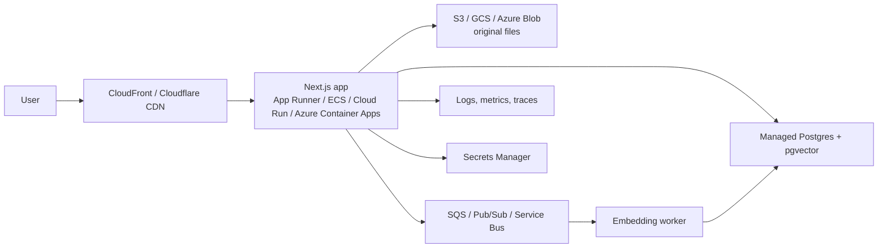

# Production Plan: Postgres + pgvector

This is the production direction for Career Intel. The local MVP uses in-memory maps so it is easy to run, but a deployed product should persist users, documents, chunks, vectors, chat history, and retrieval diagnostics.

## Why Postgres + pgvector

Postgres + pgvector is the best fit for this app because the product is not only vector search. It also needs ordinary application data:

- users and auth identities
- uploaded documents
- chunk metadata
- embeddings
- chat sessions and messages
- citations and retrieval traces
- future evaluation labels

Keeping this in one managed Postgres database avoids operating a separate vector service during the first production version. pgvector gives approximate nearest-neighbor search with HNSW indexes while Postgres still gives SQL, joins, transactions, backups, and mature cloud support.

## Target Architecture



## Data Model

Use `db/pgvector_schema.sql` as the starting schema. It includes:

- `app_user`
- `document`
- `document_chunk`
- `chat_session`
- `chat_message`
- `retrieval_event`

The vector column is currently defined as `vector(3072)` because `gemini-embedding-001` returns 3072-dimensional embeddings. If the embedding model changes, re-embed existing chunks or version embeddings by model.

## Query Pattern

The current in-memory retrieval maps directly to SQL:

```sql
select
  id,
  document_id,
  source_label,
  text,
  1 - (embedding <=> $1::vector) as score
from document_chunk
where user_id = $2
  and document_id = any($3::uuid[])
order by embedding <=> $1::vector
limit $4;
```

For balanced retrieval, run the query separately for resume chunks and job chunks, then merge/deduplicate in application code as the MVP does today.

## Migration Steps

1. Add a Postgres client dependency such as `pg`.
2. Create a `VectorStore` interface shared by the in-memory and Postgres implementations.
3. Implement `PgVectorStore` with `upsert`, `query`, `deleteByDocumentId`, and `stats`.
4. Move `DocumentRegistry` into Postgres with a repository module.
5. Store original uploaded files in object storage and extracted text/chunks in Postgres.
6. Add `DATABASE_URL`, object storage credentials, and auth configuration to environment validation.
7. Run embedding in a background worker for larger files.
8. Add migrations through Prisma, Drizzle, node-pg-migrate, or plain SQL migrations.

## Cloud Mapping

| Concern | AWS | GCP | Azure | Cloudflare |
|---|---|---|---|---|
| App runtime | App Runner / ECS Fargate | Cloud Run | Container Apps | Workers + external API service |
| Postgres + pgvector | RDS / Aurora PostgreSQL | Cloud SQL PostgreSQL | Azure Database for PostgreSQL | Hyperdrive to external Postgres |
| File storage | S3 | Cloud Storage | Blob Storage | R2 |
| Async jobs | SQS + worker | Pub/Sub + Cloud Run job | Service Bus + worker | Queues + worker |
| Secrets | Secrets Manager | Secret Manager | Key Vault | Secrets |
| Observability | CloudWatch + X-Ray | Cloud Logging + Trace | App Insights | Workers Analytics + external logs |

## Scaling Notes

- Add HNSW indexes for vector search.
- Always filter by `user_id` or tenant ID before returning chunks.
- Keep `embedding_model` on chunks so migrations can re-embed safely.
- Add object storage lifecycle policies for uploaded files.
- Add request IDs and retrieval event logging for debugging answer quality.
- Add rate limits per user to protect provider spend.
- Add eval datasets with fixed resume/JD pairs before changing chunking, embedding models, or prompts.

## What Stays The Same

The frontend, prompt construction, dynamic query context, ATS scorer, and SSE streaming can stay mostly unchanged. The main replacement is the storage layer behind document metadata and vector retrieval.
